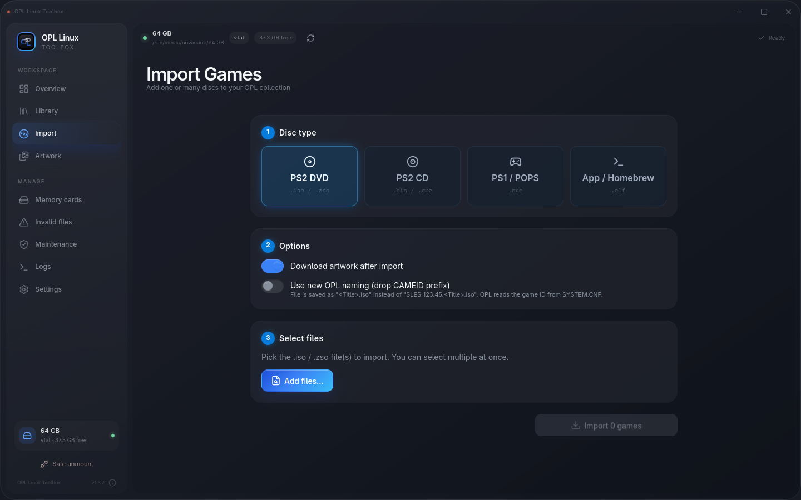
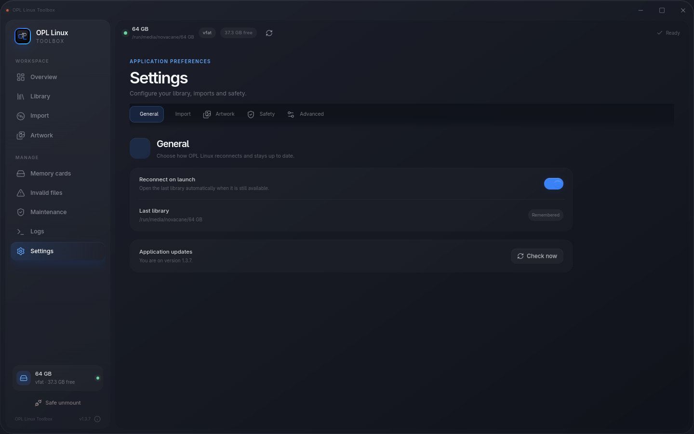

# OPL Linux Toolbox v1.3.9

v1.3.9 establishes the Linux-first distribution and safety-focused direction of OPL Linux Toolbox.

<p align="center">
  
</p>

## Highlights

- Native Linux packages for Debian/Ubuntu (`.deb`), Fedora/openSUSE (`.rpm`), Arch-based systems (`.pacman`) and portable AppImage.
- Published `SHA256SUMS` for release artifacts.
- One-command installer that selects the appropriate package and verifies downloads.
- Linux storage discovery with filesystem, capacity and free-space information.
- Safer import workflow using temporary `.part` files, optional SHA-256 verification and targeted rollback.
- FAT32 UL/USBExtreme handling for PS2 images that cannot be stored as a single FAT32 file.
- Updated blue-focused interface, branding and application screenshots.
- Corrected Arch package dependency handling.

## Install

Recommended:

```bash
curl -fsSL https://raw.githubusercontent.com/lucasonline0/opl-linux-toolbox/main/install.sh | bash
```

Or download one of the release assets manually:

| Linux family | Asset |
| --- | --- |
| Debian / Ubuntu / Mint | `opl-linux-toolbox-1.3.9-x86_64.deb` |
| Fedora / openSUSE | `opl-linux-toolbox-1.3.9-x86_64.rpm` |
| Arch-based | `opl-linux-toolbox-1.3.9-x86_64.pacman` |
| Other supported x86_64 Linux | `opl-linux-toolbox-1.3.9-x86_64.AppImage` |

Checksums are provided in `SHA256SUMS`.

## What makes this branch different

OPL Linux Toolbox remains a GPL-3.0 derivative of OrbitOPL Toolbox and preserves upstream attribution. The Linux-focused branch adds native Linux packaging, storage-aware workflows and additional transfer-safety behavior rather than presenting itself as an unrelated rewrite.

## Screenshots

### Library


### Import



### Settings



## Feedback

Testing reports are especially useful when they include:

- Linux distribution and package format;
- OPL storage type and filesystem;
- exact reproduction steps;
- relevant logs with personal paths removed.

Issues: https://github.com/lucasonline0/opl-linux-toolbox/issues

Full repository: https://github.com/lucasonline0/opl-linux-toolbox
